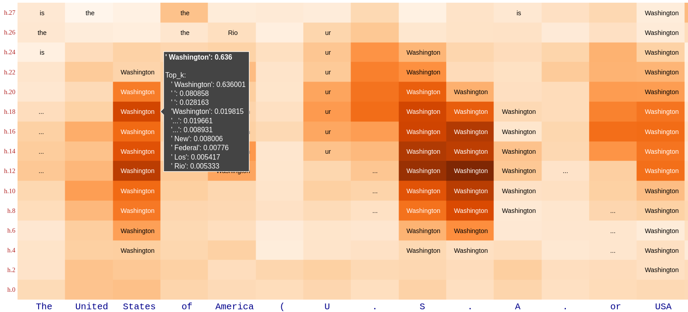

# Linearity of Relation Decoding in Transformer LMs

This repository contains the code used for the experiments in the paper [Linearity of Relation Decoding in Transformer LMs](https://arxiv.org/abs/2308.09124). 

How an LM decodes a relation such as (*Miles Davis*, **plays the instrument**, *trumpet*) involves a sequence of non-linear computations spanning multiple layers. But, in this work we show that for a subset of relations this highly non-linear decoding procedure can be approximated by a simple *linear transformation* ($\textbf{LRE}$) on the subject representation $\mathbf{s}$ at some intermediate layer. 

<p align="center">

</p>

Please check [lre.baulab.info](https://lre.baulab.info/) for more information.


## Setup

All code is tested on `MacOS Ventura (>= 13.1)` and `Ubuntu 20.04` using `Python >= 3.10`. It uses a lot of newer Python features, so the Python version is a strict requirement.

To run the code, create a virtual environment with the tool of your choice, e.g. conda:
```bash
conda create --name relations python=3.10
```
Then, after entering the environment, install the project dependencies:
```bash
python -m pip install invoke
invoke install
```

## $\mathbf{LRE}$ Demo
[demo/demo.ipynb](demo/demo.ipynb) shows how to get $LRE$ approximation for a certain relation. This notebook also explains the setup of our evaluation metrics $faithfulness$ and $causality$.

[demo/attribute_lens.ipynb](demo/attribute_lens.ipynb) demonstrates *Attribute Lens*, which is motivated by the idea that a hidden state $\mathbf{h}$ may contain pieces of information beyond the prediction of the immediate next token. And, an $\text{LRE}$ can be used to extract a certain attribute from $\mathbf{h}$ without relevant textual context. In the figure below $\text{LRE}$ approximating the relation *country-capital* is applied on hidden state $\mathbf{h}$ after different layers in different token positions.

<p align="center">

</p>


## How to Cite
```bibtex
@article{hernandez2023linearity,
    title={Linearity of Relation Decoding in Transformer Language Models}, 
    author={Evan Hernandez and Arnab Sen Sharma and Tal Haklay and Kevin Meng and Martin Wattenberg and Jacob Andreas and Yonatan Belinkov and David Bau},
    year={2023},
    eprint={2308.09124},
    archivePrefix={arXiv},
    primaryClass={cs.CL}
}
```